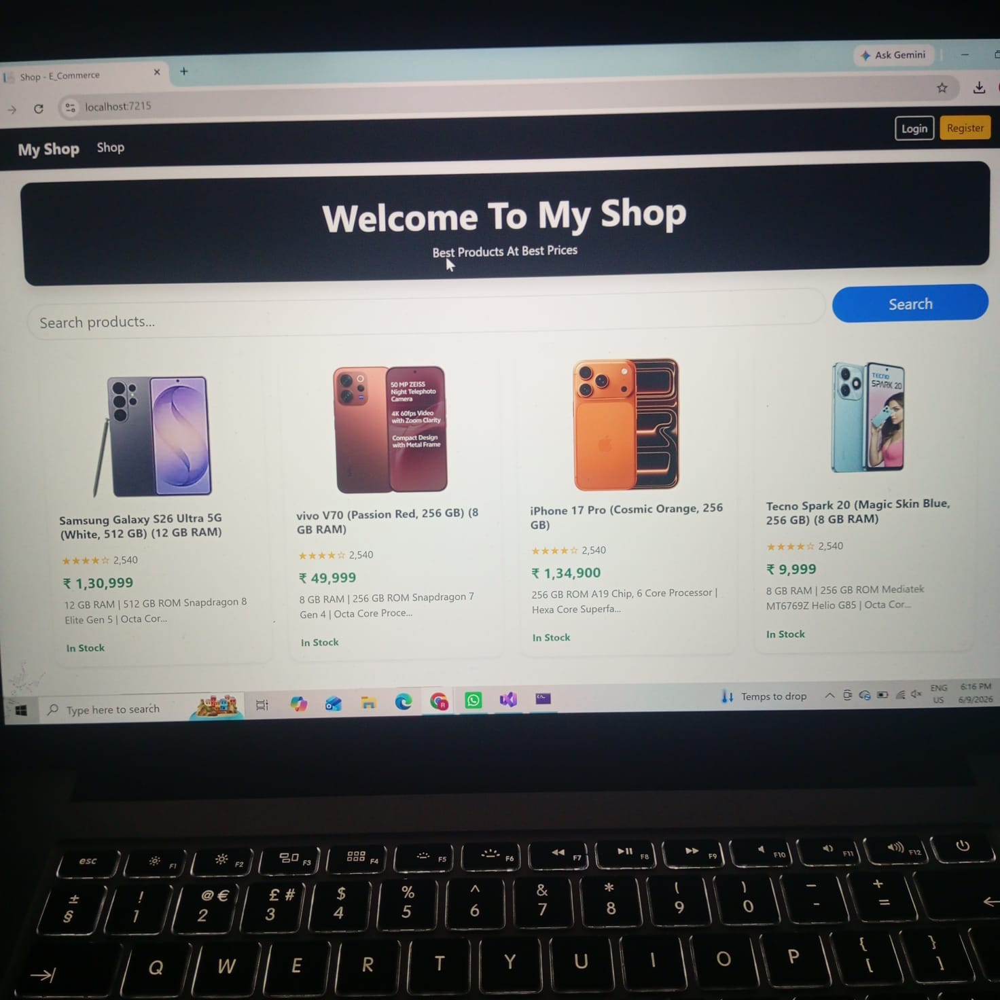
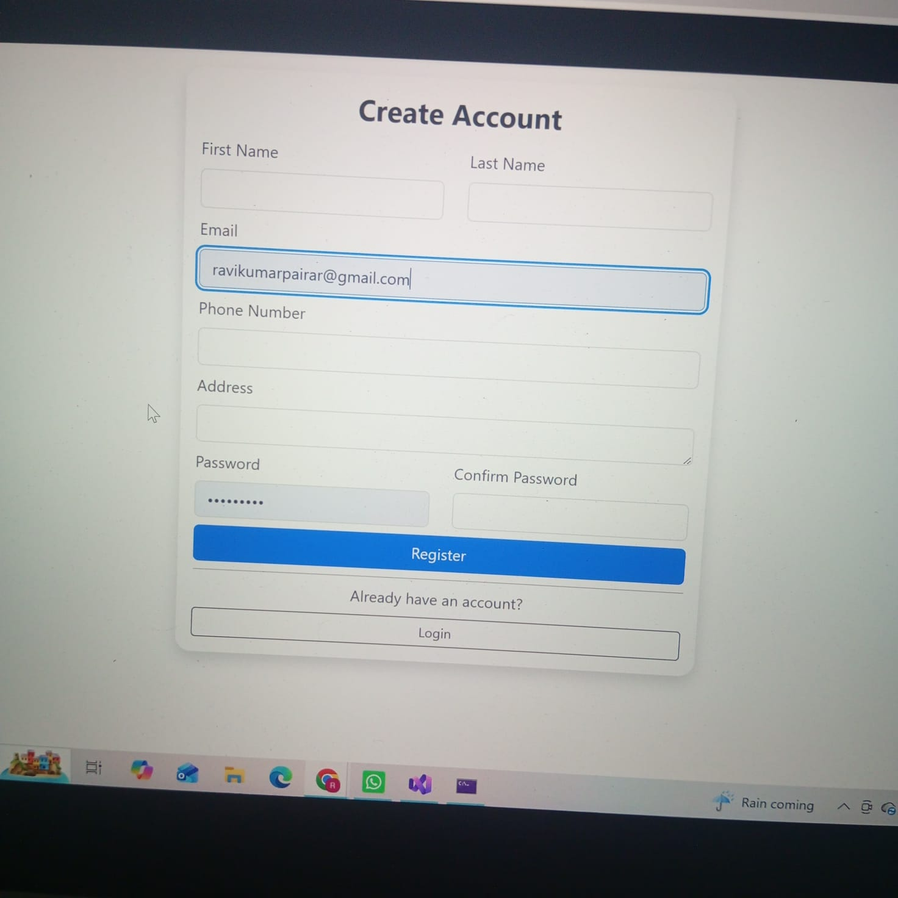
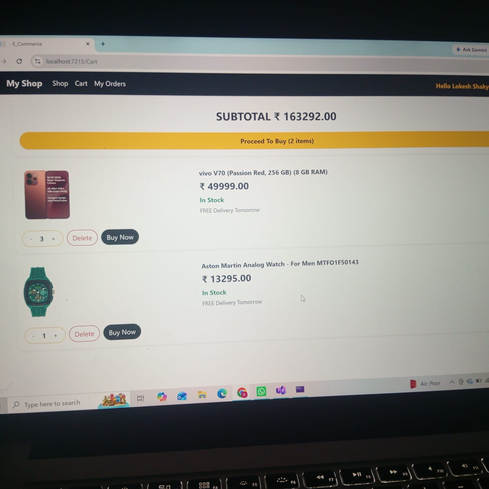
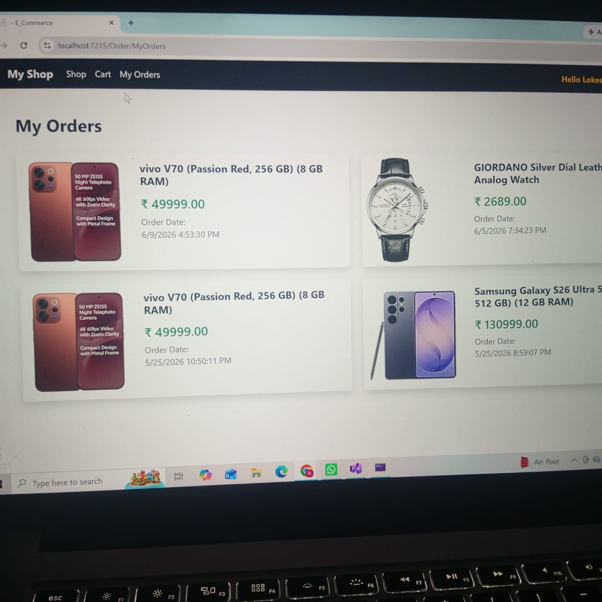
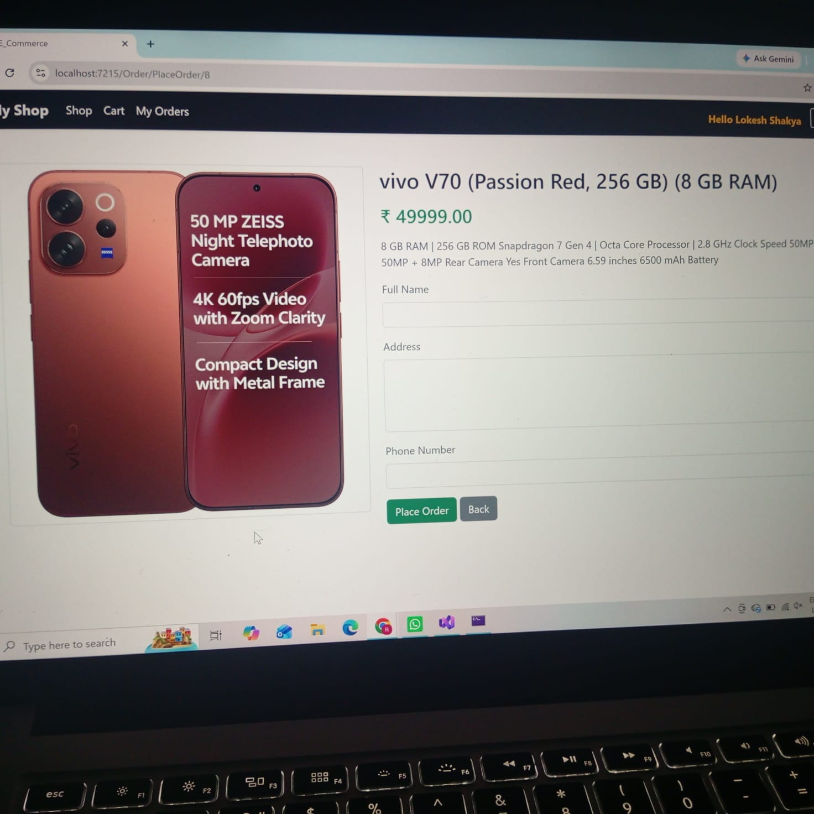
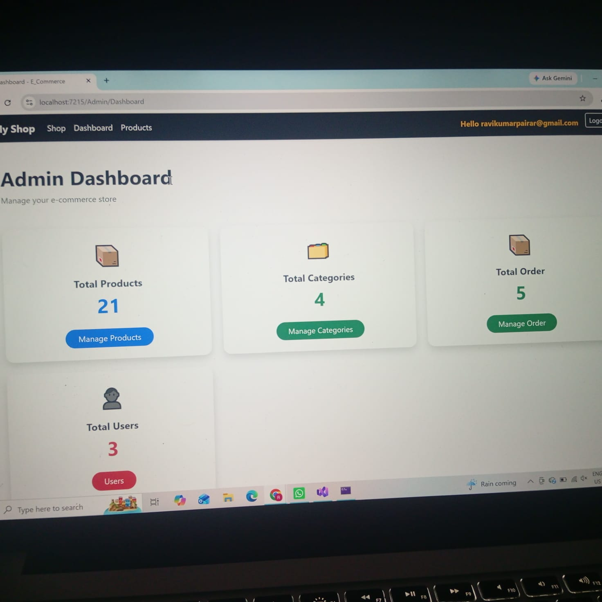
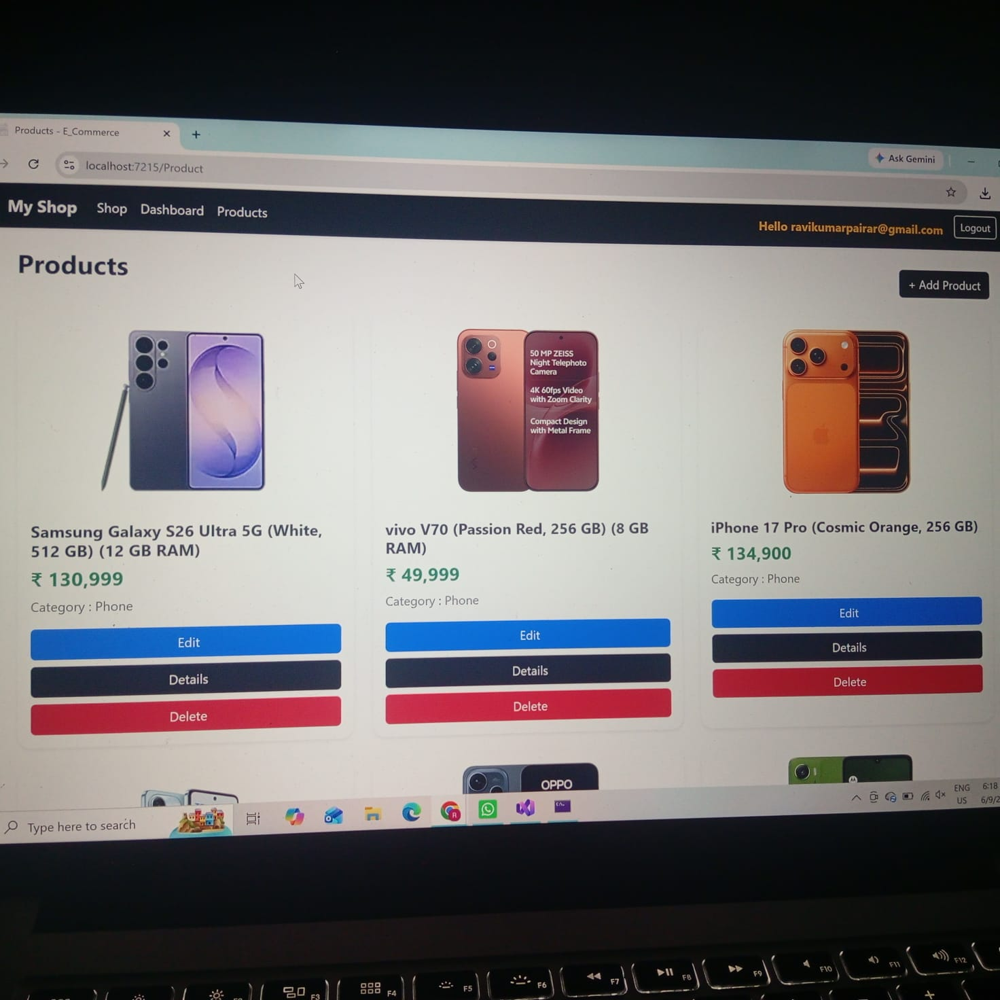

# E-Commerce ASP.NET Core MVC

E-Commerce Web Application built using ASP.NET Core MVC, Entity Framework Core and SQL Server.

## Features
- Authentication & Authorization
- Product Management
- Category Management
- Shopping Cart
- Admin Panel
- CRUD Operations

## Technologies Used
- C#
- ASP.NET Core MVC
- Entity Framework Core
- SQL Server
- Bootstrap
## Screenshots

### Home Page

### Register Page

### Login Page

### Cart

### Order Page

### Place Order

### Admin Dashboard

### Product Management

